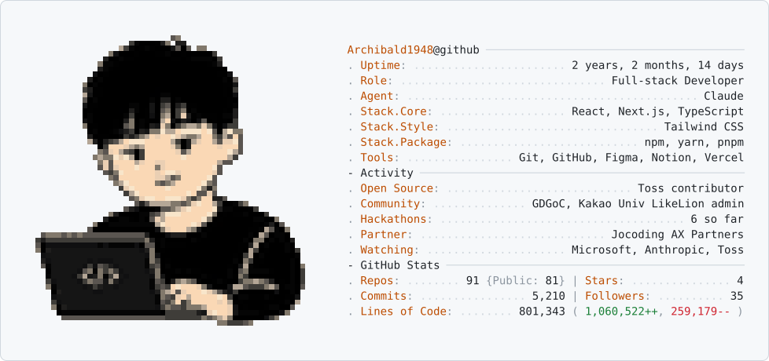
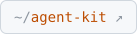

### Hello. I'm developer

<picture>
  <source media="(prefers-color-scheme: dark)" srcset=".github/images/profile-card-dark.svg" />
  <source media="(prefers-color-scheme: light)" srcset=".github/images/profile-card-light.svg" />
  
</picture>

<!-- Pac-Man Contribution Graph -->

  <picture>
    <source media="(prefers-color-scheme: dark)" srcset="https://raw.githubusercontent.com/Archibald1948/Archibald1948/main/.github/images/github-contribution-grid-pacman-dark.svg" />
    <source media="(prefers-color-scheme: light)" srcset="https://raw.githubusercontent.com/Archibald1948/Archibald1948/main/.github/images/github-contribution-grid-pacman.svg" />
    
  </picture>

<!-- 링크 버튼: SVG 안의 링크는 README에서 클릭되지 않아 버튼을 따로 감싼다 -->

  <a href="https://github-gamma-seven.vercel.app"><picture><source media="(prefers-color-scheme: dark)" srcset=".github/images/link-dashboard-dark.svg" /></picture></a>
  <a href="https://github.com/Archibald1948/TIL"><picture><source media="(prefers-color-scheme: dark)" srcset=".github/images/link-til-dark.svg" /></picture></a>
  <a href="https://github.com/Archibald1948/agent-kit"><picture><source media="(prefers-color-scheme: dark)" srcset=".github/images/link-agent-kit-dark.svg" /></picture></a>
  <a href="https://github.com/Archibald1948/Archibald1948/actions/workflows/sync-forks.yml"><picture><source media="(prefers-color-scheme: dark)" srcset=".github/images/link-sync-forks-dark.svg" /></picture></a>
  <a href="https://jocodingax.ai"><picture><source media="(prefers-color-scheme: dark)" srcset=".github/images/link-jocodingax-dark.svg" /></picture></a>
  <a href="https://github.com/microsoft"><picture><source media="(prefers-color-scheme: dark)" srcset=".github/images/link-microsoft-dark.svg" /></picture></a>
  <a href="https://github.com/anthropics"><picture><source media="(prefers-color-scheme: dark)" srcset=".github/images/link-anthropic-dark.svg" /></picture></a>
  <a href="https://github.com/toss"><picture><source media="(prefers-color-scheme: dark)" srcset=".github/images/link-toss-dark.svg" /></picture></a>

